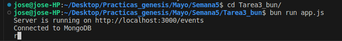
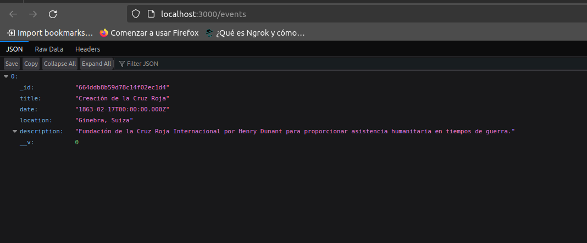
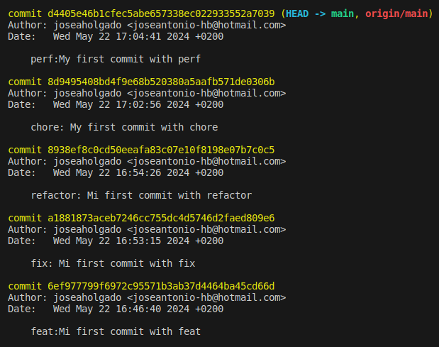

# Historical Events API

This project is a RESTful API developed with Express and Mongoose that manages a database of events that changed humanity. It allows performing CRUD (Create, Read, Update, Delete) operations on the historical events stored in MongoDB.

## Quick Start

To run this project locally, you will need to have Node.js and MongoDB installed on your system.

### Prerequisites

- Node.js
- npm (Node Package Manager)
- MongoDB

## Installation and Setup

1. **Clone the repository**:
   ```bash
   git clone https://github.com/joseaholgado/Proyecto_bun.git
   cd Proyecto_bun

2. **Install Bun:**:
   ```bash
   curl https://bun.sh/install | bash


3. **Install dependencies:**:
   ```bash
   bun install


4. **Run MongoDB:**:
   ```bash
   mongod


5. **Run the server:**:
   ```bash
   bun run index.mjs

# Making Commits

To maintain a clean and understandable commit history, use the following types of commits:

    fix: Commits that fix a bug.
    feat: Commits that introduce a new feature.
    refactor: Commits that refactor code without changing functionality.
    chore: Commits for minor tasks and maintenance.
    perf: Commits that improve performance.

## Example of Making Commits

1. Stage your changes:  
    ```bash
    git add .

2. Make a commit:
    ```bash
    git commit -m "fix: correct the server start command"

3. Push your changes to GitHub:
    ```bash
    git push origin main

## Exercise Screenshots

1. Create a repository and recreate the Node and Express challenge using only Bun





2. Create commits with fix, feat, refactor, chore, perf



## Repository
https://github.com/joseaholgado/Proyecto_bun

