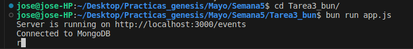
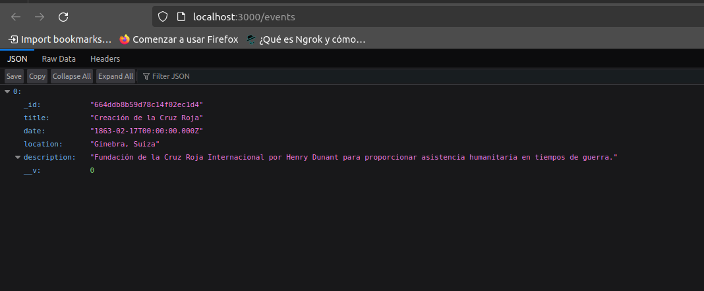

# API de Eventos Históricos

Este proyecto es una API RESTful desarrollada con Express y Mongoose que gestiona una base de datos de eventos que cambiaron la humanidad. Permite realizar operaciones CRUD (Crear, Leer, Actualizar, Eliminar) sobre los eventos históricos almacenados en MongoDB.

## Inicio Rápido

Para ejecutar este proyecto localmente, necesitarás tener instalado Node.js y MongoDB en tu sistema.

### Requisitos Previos

- Node.js
- npm (Node Package Manager)
- MongoDB


# bun

Para instalar dependencias:

```bash
bun install
```

To run:

```bash
bun run index.ts
```

### Instalación

1. Clona el repositorio en tu máquina local:
   ```bash
   git clone https://github.com/joseaholgado/Proyecto-con-Bun.git
   cd ruta_al_repositorio

## Capturas de los ejercicios

1. Crear un repositorio y recrear el desafío Node y Express usando solo Bun



2. Crear commits con fix, feat, refactor, chore, perf
